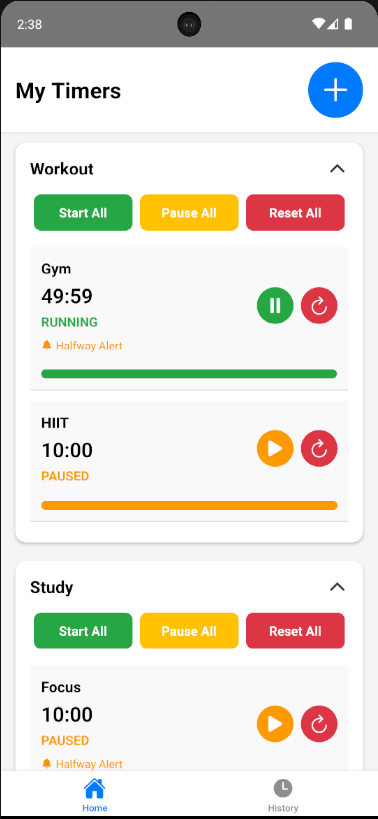
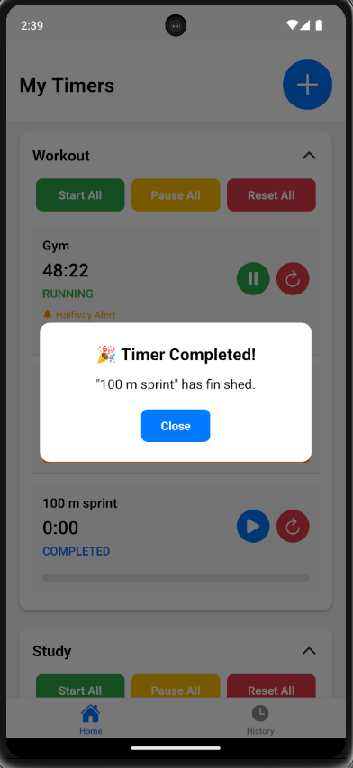
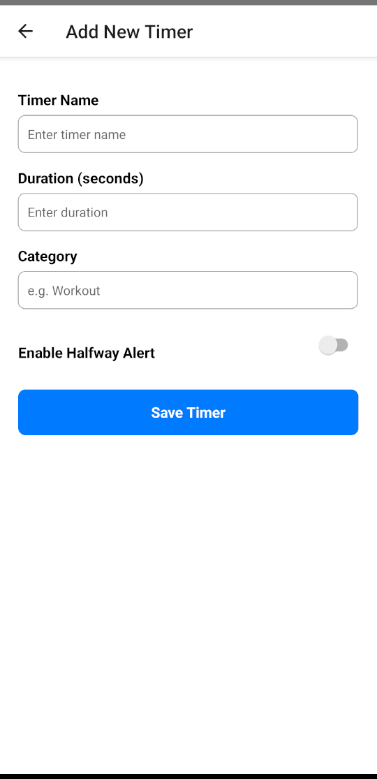
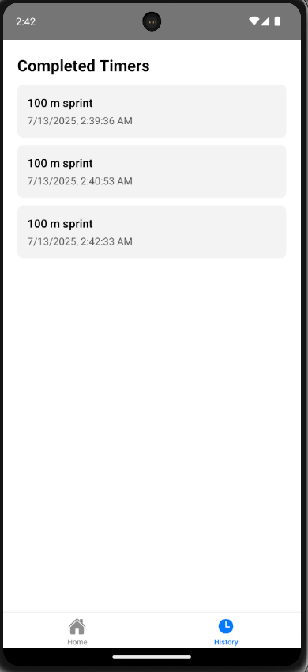

# ⏱️ Timer Manager App

A feature-rich React Native app. The app allows users to manage categorized timers with play, pause, reset, and bulk controls, view history of completed timers, and receive local notifications for halfway and completed timers — all with persistent state management.

---

## 📱 Features

- ✅ **Tabbed Navigation**: Switch between Home and History tabs
- ⏳ **Create and Manage Timers**: Assign timers to categories with duration, name, and halfway alert
- 📂 **Expandable Categories**: Tap a category to view its timers
- ▶️ **Play, Pause, Reset** timers individually
- 🔁 **Bulk Actions**: Start/Pause/Reset all timers in a category
- 🕓 **Local Notifications** using Notifee:
  - Halfway alert (toast)
  - Completion alert
- 🧠 **Redux Toolkit** for global state management
- 💾 **AsyncStorage** to persist timers and history between sessions
- 🕘 **History Tab**: Shows completed timers with timestamp

---

## 📦 Tech Stack

- **React Native CLI**
- **Redux Toolkit**
- **Notifee** (Local Notification Library)
- **AsyncStorage**
- **Ionicons**
- **FlatList / TouchableOpacity / StyleSheet**

---

## 🛠 Setup Instructions

### 🔧 Clone & Install Dependencies

```bash
git clone <your-repo-url>
cd timer-app
npm install
```

### 🔧 Build APK (Android Only)

```bash
cd android
./gradlew assembleRelease
```

✅ APK generated at:

```
android/app/build/outputs/apk/release/app-release.apk
```

You can now install it on your Android device.

---

## 📸 Screenshots

> 



---

## 📁 Folder Structure (Highlights)

```
src/
├── components/          // Reusable UI components (CategoryCard, TimerItem)
├── screens/             // HomeScreen, HistoryScreen, AddTimerScreen
├── redux/               // Redux slice and store setup
├── utils/               // Helper utils and notification setup
```

---

## 🧑‍💻 Author

**Neeraj Jangra**  
React Native Developer

---

## 🔚 Notes

- Tested on Android 14 Emulator & Real Device
- Firebase-free implementation using Notifee
- Supports local notification permission requests for Android 13+

---
